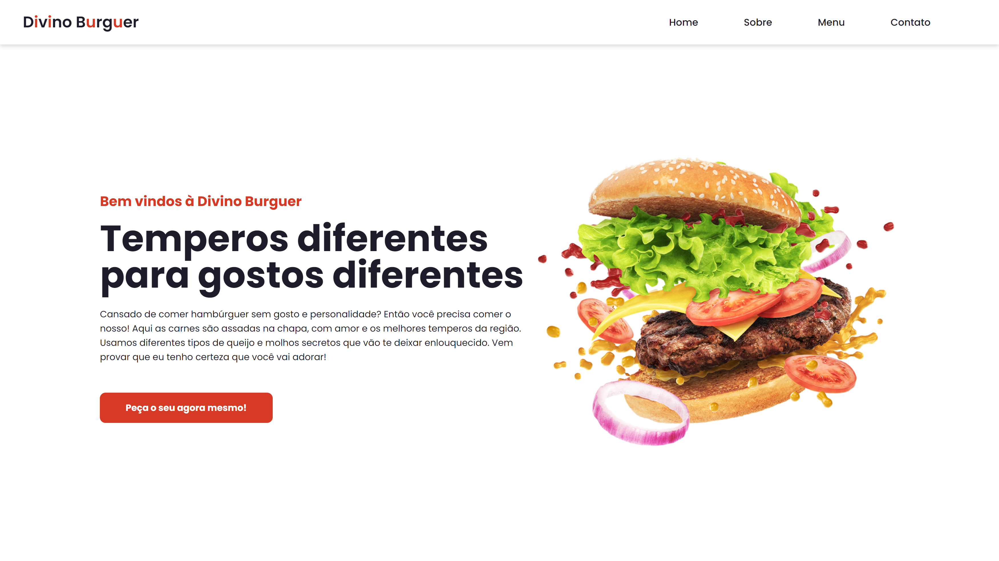

# Landing Page

## 💻 Projeto

Este projeto foi realizado com base no que foi desenvolvido pelo [DevEnvolvente0190](https://github.com/DevEnvolvente0190), o qual criei uma landing page para fazer propaganda de um lanche com um landing responsiva. 

  <a href="#-projeto">Projeto</a>&nbsp;&nbsp;&nbsp;|&nbsp;&nbsp;&nbsp;
  <a href="#-tecnologias">Tecnologias</a>&nbsp;&nbsp;&nbsp;|&nbsp;&nbsp;&nbsp;
  <a href="#memo-licença">Licença</a>&nbsp;&nbsp;&nbsp;

  

_**Veja o resultado [clicando aqui](https://beaasb.github.io/Landing-Page/)**_

## 🚀 Tecnologias 
Esse projeto foi desenvolvido com as seguintes tecnologias:

    - HTML
    - CSS
    - Git e GitHub
    - JavaScript
   
## :memo: Licença

Esse projeto está sob a licença MIT.

## ✉️ Contatos
    
  
    
   
    
---

Feito com ♥ by Bea :wave: